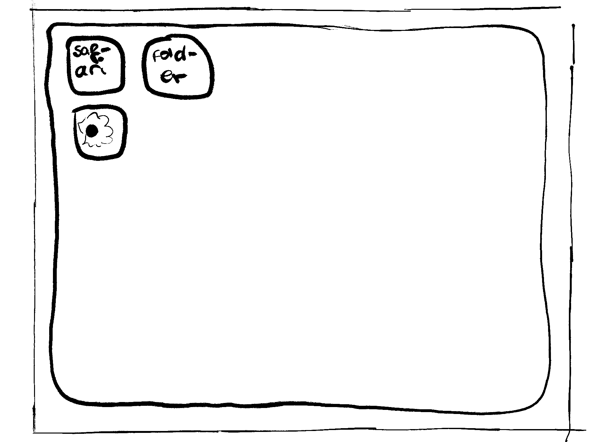
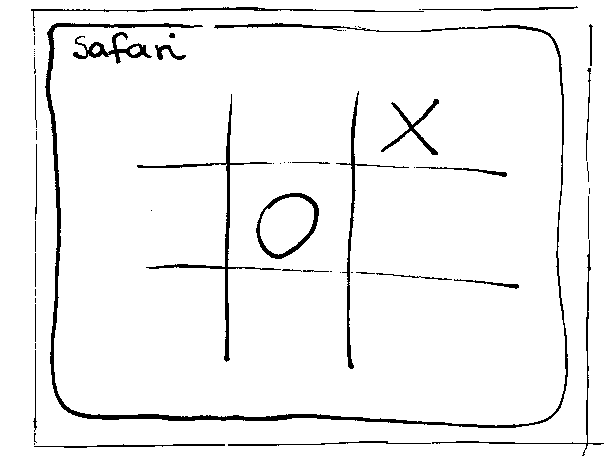
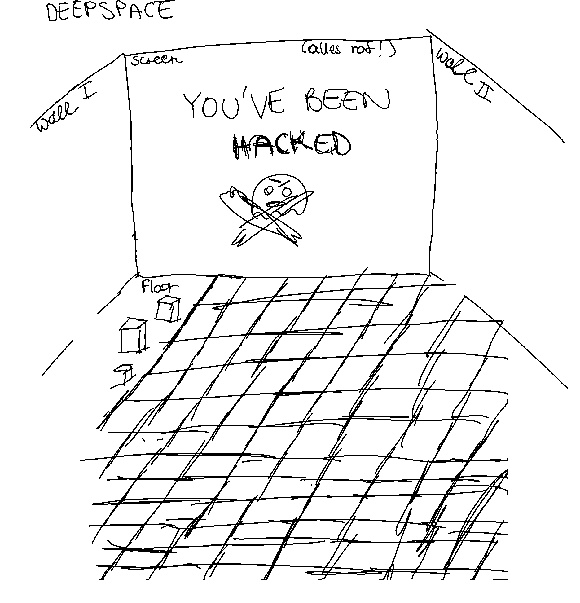

# HackTrap
HackTrap is an AEC-DeepSpace-Game which teaches young children how to deal safely with the digitized internet world by playing through an exciting hacker-attack and killing the virus.

## Our Team
Christian Ekhator, Julian Kapl, Julia Meyr & Amina Gabeljic

## 1. Initial Situation
### 1.1. Current Situation
Since children tend to learn about Internet use at an early age, they still have little idea of what is happening in the background.
The current project from the AS Elektroniker Center in Linz, NewHorizon, explains to children how data is distributed. However, dangers can arise that children are not yet aware of.

### 1.2. Potential for improvement
#### Problems
- The children usually have no knowledge about the dangers that the internet comes with
- Outdated technology / game

#### Improvements
- A better overview of the dangers on the Internet
- Let the cooperation be maintained
- Another learning effect for children

## 2. Goal
Our goal is to teach children that there are dangers and traps on the Internet. CubeIT should trigger a learning effect that shows the children how they should react and what happens if they (unintentionally) do something wrong.

## Target state

### Start of the game
The start begins with the screen on the wall producing a preview of an iPad, with 3 apps being displayed on the iPad. It should stay with only 3 apps, so as not to overwhelm the children with too many app displays at the beginning.

Overview of the 3 apps:
1st App: Safari
2nd App: Folder
3rd app: Settings

### Safari: 3 games
Safari opens automatically, and then you have the option to play three different games. This is to ease the tension at the beginning.

How do the children choose a game?
Three fields appear on the floor, which is for the selection of the desired game. The fields on the floor should be the same size as the "game fields" on the screen. Whichever field has more users inside, that game is selected. 

Overview of the 3 different games:
1st game: Rock-Scissor-Paper
2nd game: Tic-Tac-Toe
3rd game: Memory

### Opening an app
In this example, we open the game Tic-Tac-Toe and the children can play the respective game to the end.

### Question to continue playing
After the end of the game, a box will appear above the game where the question will come: "Do you want to continue?". Here, two squares will appear on the floor, with the squares being the same size as the buttons on the screen to select "Yes" or "No".
Here again, the children choose whether they want to select "Yes" or "No" by climbing on one of the respective fields.
What the children don't know, however, is that no matter whether "Yes" or "No" is selected, when each button is clicked, the hacker attack will be sent in any case - so it doesn't really matter whether the children click on "Yes" or "No".

### Pop-up attack
Suddenly, loud flickering pop-ups appear, and the children immediately notice that something is wrong. Various random memes are to be displayed on the pop-ups.

### Boom
After numerous random memes appeared and disappeared on the screen, the entire DeepSpace finally goes black, and at the same time, you hear a 'Boom.' This is meant to symbolize the 'shutdown' of DeepSpace or represent the complete takeover by the hacker.

### You've Been Hacked
In the next moment, the entire DeepSpace will turn red, and at the same time, everything will beep. On the front of the screen, the message 'You've been Hacked!' will be displayed (+ skull).

### Game On The Floor
Then red "cubes" with skulls pop up on the floor. To the left of DeepSpace, there are 3 large boxes symbolized on the floor.
If now a child/person enters the DeepSpace floor, a box appears under the feet. Each crate should have a small counter above it that goes up to 5. (Display: 0/5, 1/5, etc.).
Now each person who automatically has a crate with the capacity of 5 can pick up the red hacker cubes. If the own crate is full, the person runs to one of the 3 big crates at the left edge and stands on one of the 3 crates. If you stand on one of the 3 boxes, your own box is emptied and the capacity is now back to 0/5. So now we can go collect more red Hacker Cubes again!

### Hacked Again - Game On The Wall
When all red hacker cubes have been removed from the floor, the floor turns black again and the boxes are gone. 
Now, however, the hacker attacks again and infects the wall of DeepSpace. Now loud red hacker cubes pop up again on the wall up to a height of 1.70 - 1.75 meters. However, these must now be removed by "touch". That is, if you touch a red hacker cube, it disappears again - so you clean the wall again from the hacker viruses. 

### Succes - DeepSpace is virusfree
So both the floor and the wall have been freed from the hacker viruses! Now the entire room turns blue, and "SUCCES" is displayed in large letters on the front of the screen. So the children have managed to make the DeepSpace virus-free again. In addition, a certain "success sound" is to sound.

## 3. Risk Analysis

### Opportunities

- Teaching children a future-oriented approach to the internet and social media in a playful manner.
- Maintaining cooperation with the AEC.
- The project remains within the AEC DeepSpace - support for both HTL Leonding and AEC due to the cooperation.

### Project Risks

- Complications in the complex and new environment (Unity, etc.).
- Incorrect estimation of time requirements (time management).
- Complications in collaboration with the AEC/DeepSpace.

## 4. Project Workflow

### 4.1 Framework

#### Personnel

- Clear role distribution.
- Clean code.
- Democracy.
  - Consensus on decisions among team members.
  - Mutual support.
- Thorough documentation.
  - Git commits.
  - Versions.
  - Bug fixes.

#### Financial

- The tools we use should be freely available to us.
- Possibly: financial support/private contributions.

### 4.2 Development Environment

#### Environment

- GitHub.
- Unity.
- Visual Studio 2022.

### 4.3 Project Implementation Milestones

#### Winter Semester

- Approval of the project proposal.
- Task allocation (who does what?).
- Familiarization with Horizon.
- "First-Guide-In" into the app.
- Website design (wireframe).
  - Demo with test data.
- Creating the database and importing test data.

#### Summer Semester

- Web server.
- Interfaces between the components.